# POC-ARGOCD

## Install Minikube

First, we need to install **Minikube**.
In order to do so, we need to go on the [official website](https://minikube.sigs.k8s.io/docs/start/)

```bash
$ curl -LO https://storage.googleapis.com/minikube/releases/latest/minikube-linux-amd64
$ sudo install minikube-linux-amd64 /usr/local/bin/minikube
$ minikube start
```

We also need to install kubectl, minikube make it easy using the minikube command:

```bash
$ minikube kubectl -- get po -A
```

It's also a good idea to make an alias to use `kubectl` as an alias for `minikube kubectl`.

```bash
alias kubectl="minikube kubectl --"
```

## Install ArgoCD on minikube

Second, we need to install **ArgoCD**.
In order to do so, we need to go on the [official website](https://argo-cd.readthedocs.io/en/stable/getting_started/)

With Minikube installed, we can install argocd on top of it.  
Let's create the appropriate namespace

```bash
$ kubectl create ns argocd
# OR
$ minikube kubectl create ns argocd
```

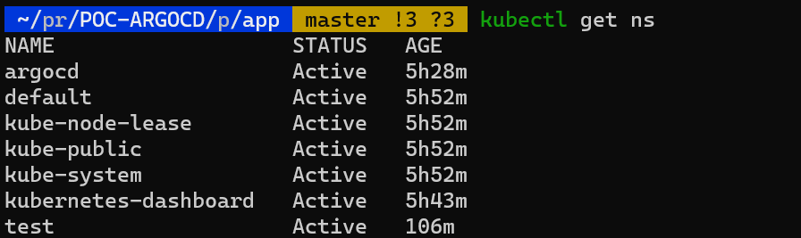

Then, we apply the manifest from the ArgoCD github repository

```bash
$ kubectl apply -n argocd -f https://raw.githubusercontent.com/argoproj/argo-cd/stable/manifests/install.yaml
```

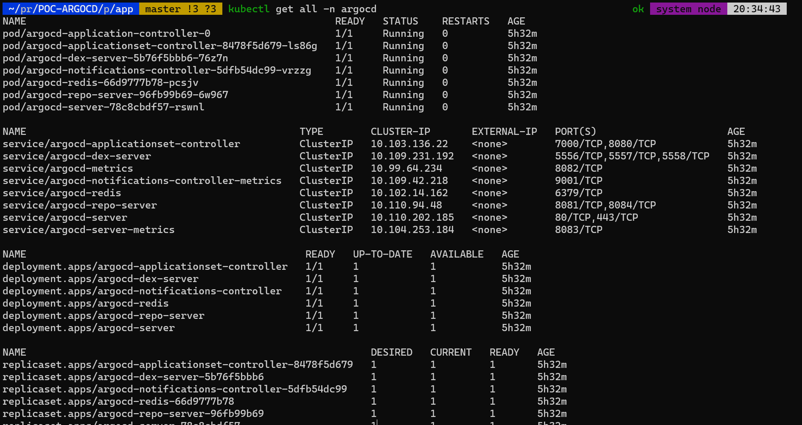


Et voila!

## Deploy our nginx app with ArgoCD

In order to access our argoCd, we gonna use the argocd-server service and forward the port 8080.

```bash
$ kubectl port-forward svc/argocd-server -n argocd 8080:443
```

We can now access the argocd on [https://localhost:8080](https://localhost:8080/)
In order, to access, we will need an account. Fortunately, an `admin` account has been created with a random password.
To get the password, use teh following command:

```bash
$ kubectl -n argocd get secret argocd-initial-admin-secret -o jsonpath="{.data.password}" | base64 -d; echo
```

The credential are the following:
**username:** admin
**password:** See previous command 


We are now log on ArgoCD.

In the right menu, let's click on `Settings` and then `repositories`.

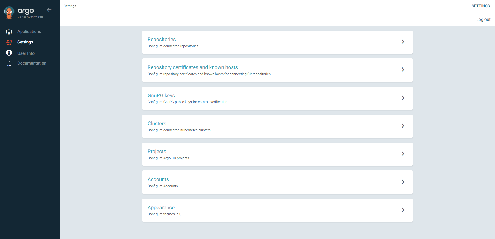

Let's connect our github repository that contain the manifest of our nginx application.
The information to fill up are the following:

**Name:** Whatever
**Project:** default
**Repository URL:** https://github.com/JustalK/POC-ARGOCD.git

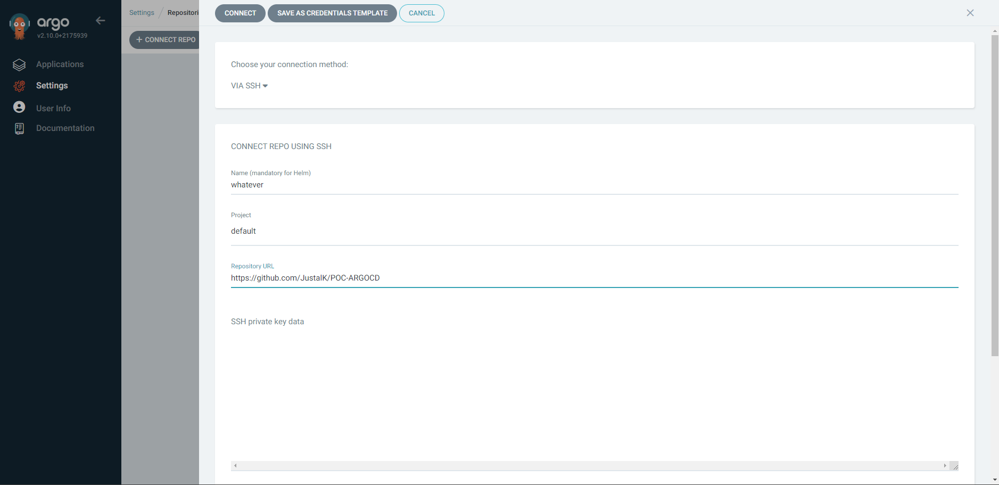

We should have a connection successful. If yes, we can continue and click on `Create application`.

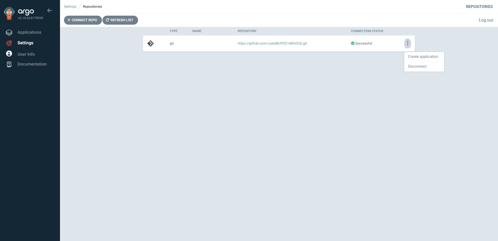

We are now registering all the information require to create our application.

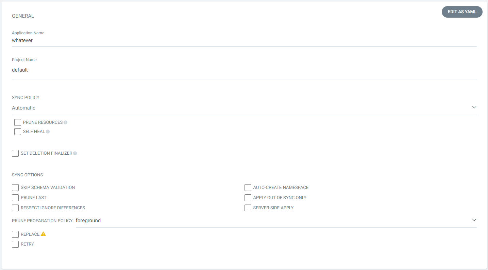
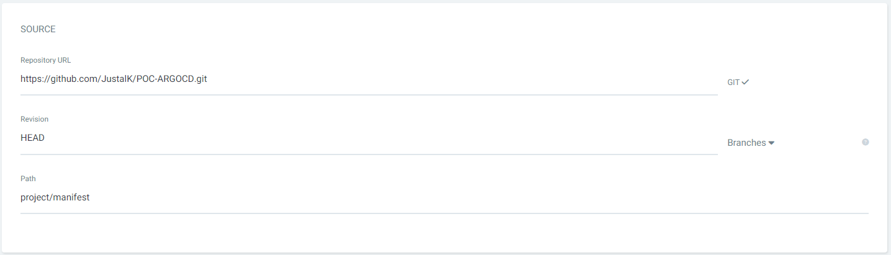
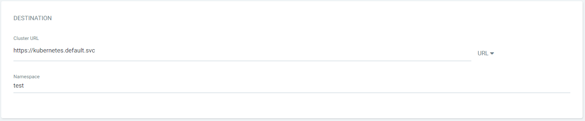

Upon validating, we should be redirected to our application with our healthy `poc` application. If we click on it, we can see the different connection between our resources in our Minikube.

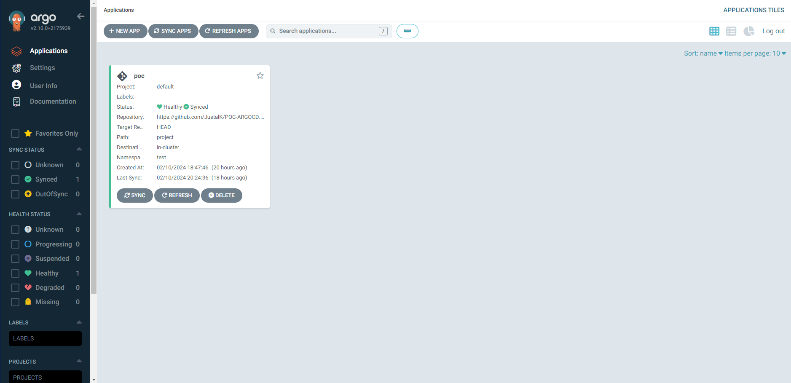
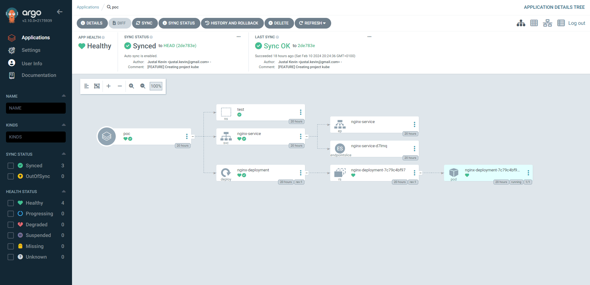

To access, our nginx application, we can use Minikube to expose it (I am using WSL, so I have no choice):

```bash
$ minikube service nginx-service -n test --url
```

## Messing up with the Minikube

To see all the power of ArgoCD, we can start messing up with the resources in our Minkube. Let's create a service that we have not inidicate in our manifest.

```bash
$ kubectl expose deployment nginx-deployment -n test --type=NodePort --name=example-service
```

Oh no! We just added a new service but no one in the team knows about it. That's not a problem because ArgoCD is already monitoring the Kube and just find out the illegal service.

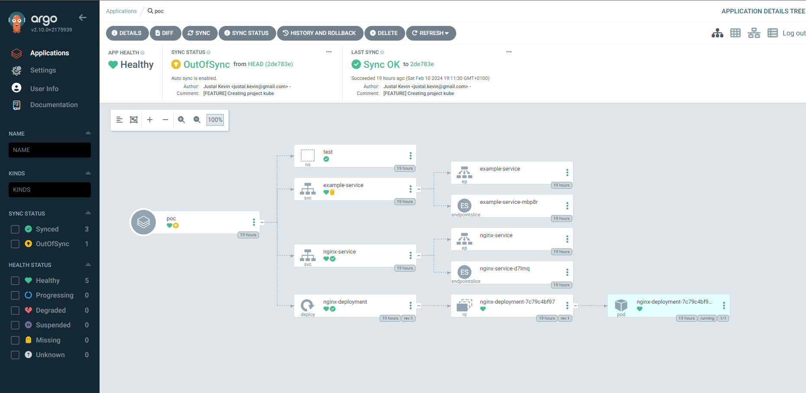

At this point, it's possible to decide what to from here, either rollback to a previous state, delete the illegal resouces... And so on